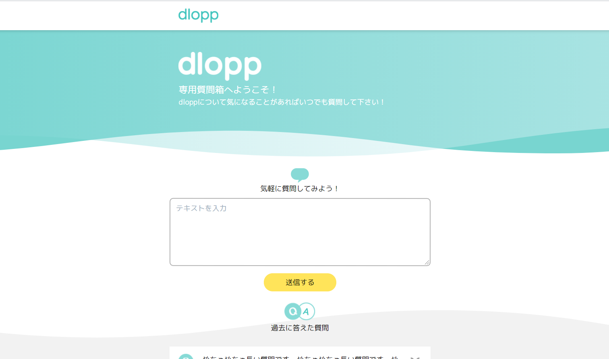

# Question Box

Question Boxはdlopp専用の質問箱です。


## :camera_flash: Screenshot


## :recycle: Change Log
[CHANGELOG.md](CHANGELOG.md)

## :earth_asia: Roadmap
- https://github.com/dlopp/question-box/projects/1

## :hammer_and_wrench: Setup
```bash
  # リポジトリをローカルにクローン
    git clone https://github.com/dlopp/question-box.git
  # クローン下リポジトリに移動
    cd question-box
  # npm経由でyarnをインストール
    npm install -g yarn
  # 依存関係をインストール
    yarn install
  # ローカルサーバーを起動しアクセス
    yarn dev --open
  # ctrl + c でサーバーを停止できます。
```

## :zap: Technologies used
- Nuxt.js
- Tailwind CSS
- Firebase
  - Firebase Authentication
  - Cloud Firestore
- Cloudinary

## :books: Reference
- [Peing(ペイング) -質問箱- 匿名で質問を受け取ろう](https://peing.net/ja/)

## :star2: Contribution
以下のGitHub Wikiに貢献ルールを書きました。
- https://github.com/dlopp/question-box/wiki

## :partying_face: Contributors
- [@Daaiki](https://github.com/Daaiki)
- [@whooolemilk](https://github.com/whooolemilk)
- [@yuto14prog](https://github.com/yuto14prog)